# Performance Comparison: Old vs New

## Entry Graphs Comparison

| Mode              | Old                                                             | New                                                             |
| ----------------- | --------------------------------------------------------------- | --------------------------------------------------------------- |
| **Pre-Generated** | 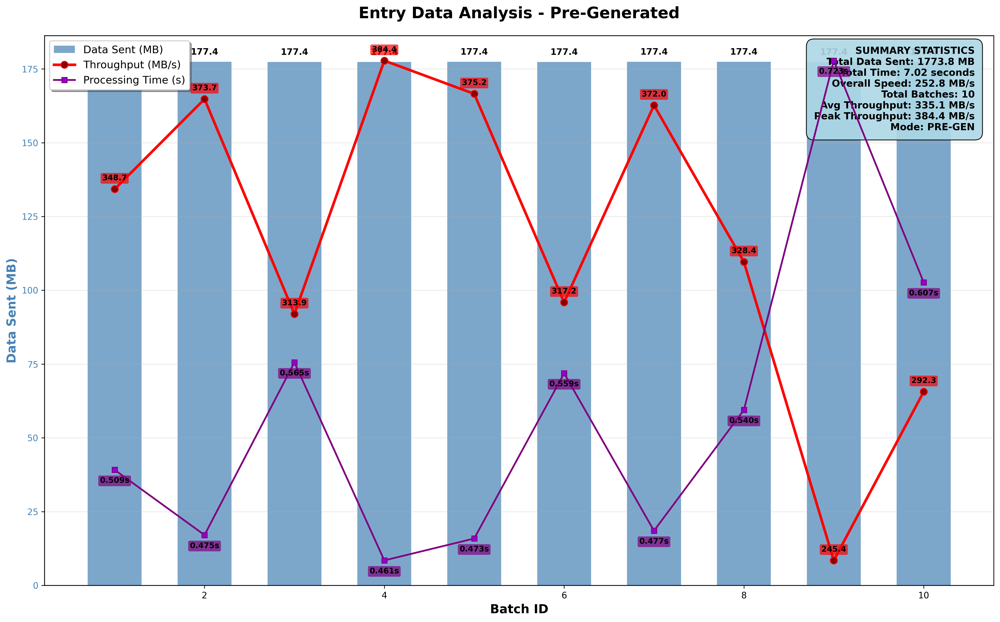     | 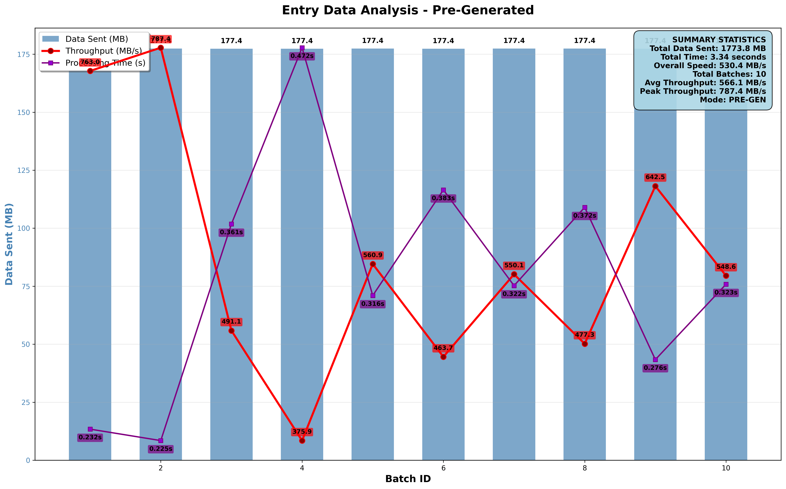     |
| **Real-Time**     | 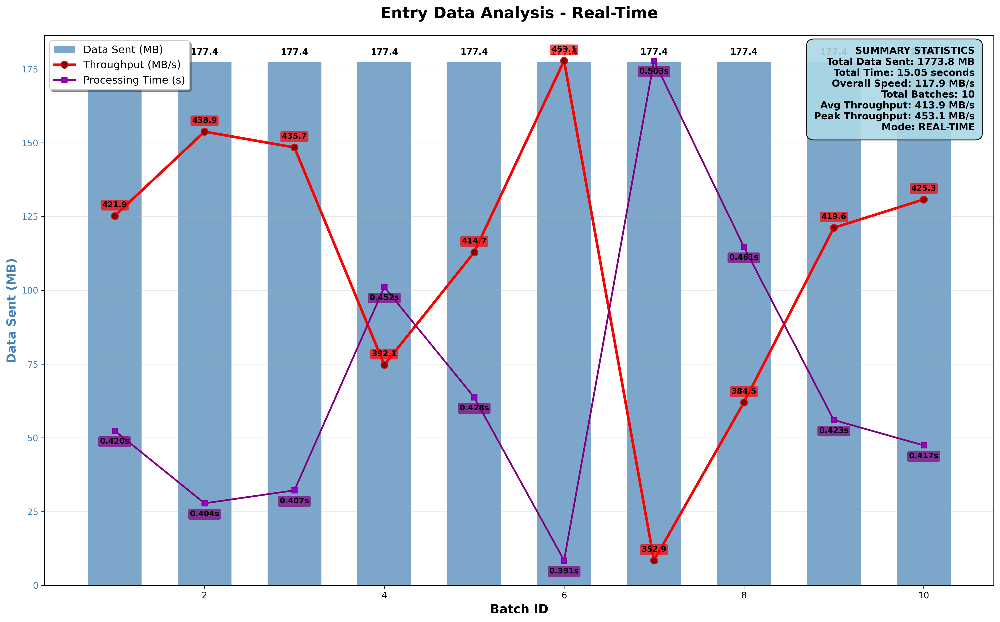 | 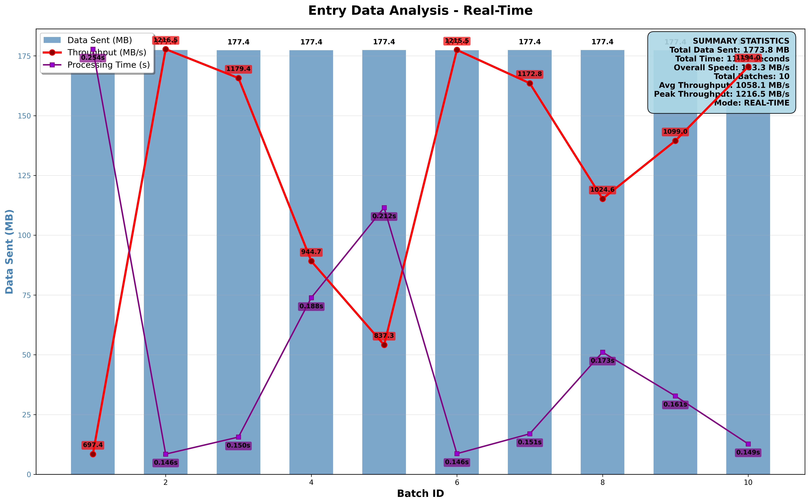 |

---

## Processor Graphs Comparison

| Mode              | Old                                                                     | New                                                                     |
| ----------------- | ----------------------------------------------------------------------- | ----------------------------------------------------------------------- |
| **Pre-Generated** | 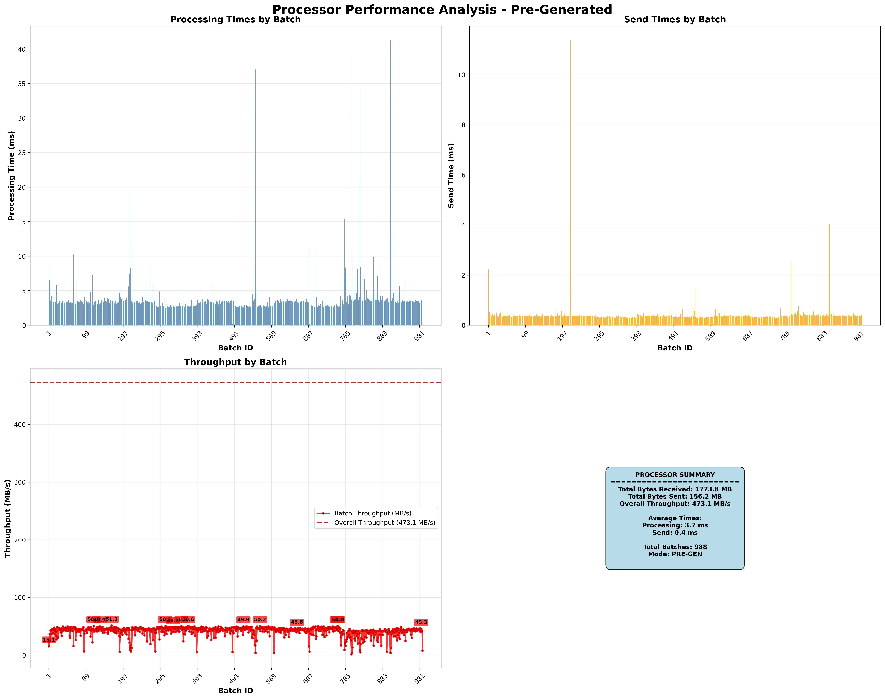     | 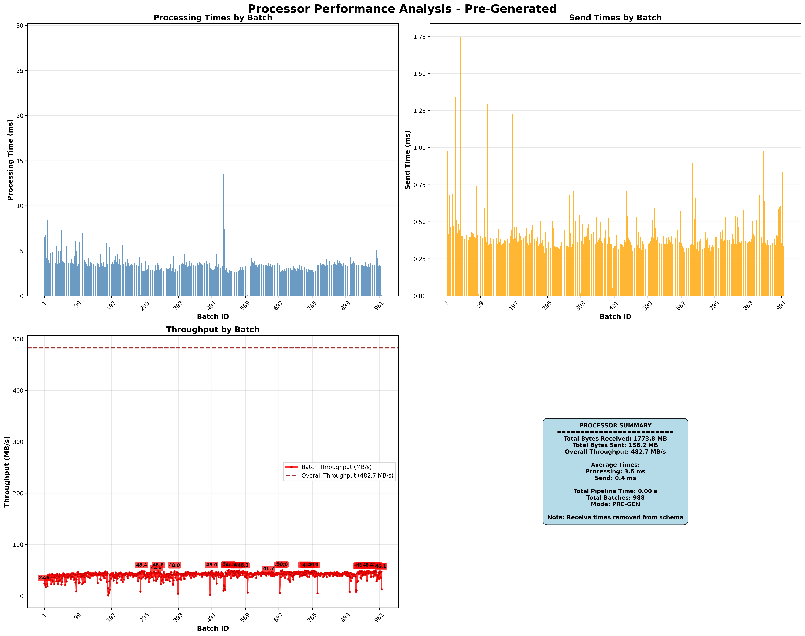     |
| **Real-Time**     | 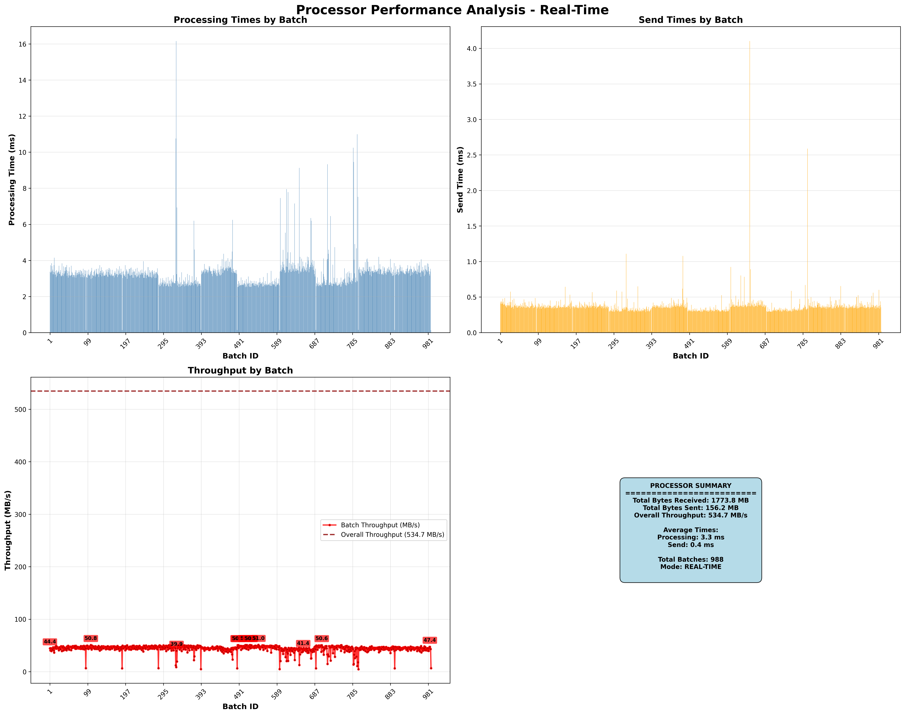 | 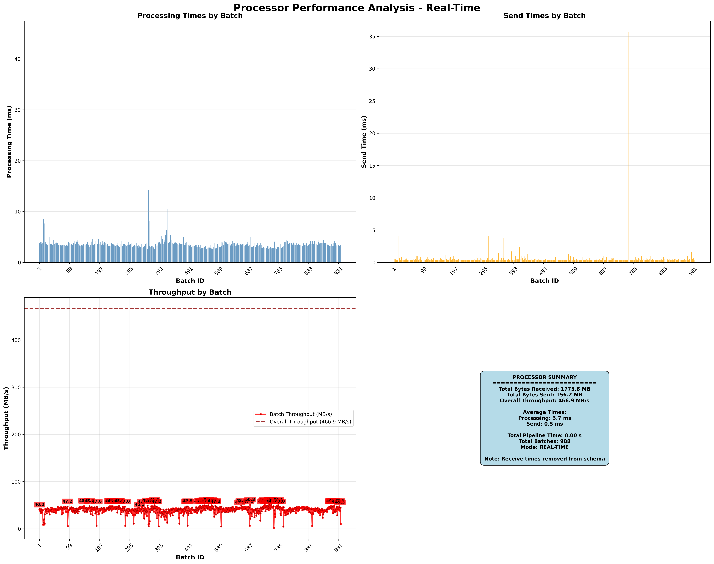 |

---

## Exit Graphs Comparison

| Mode              | Old                                                           | New                                                           |
| ----------------- | ------------------------------------------------------------- | ------------------------------------------------------------- |
| **Pre-Generated** | 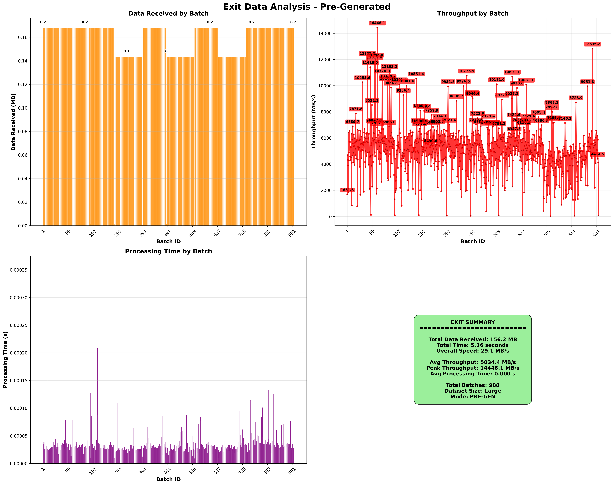     | 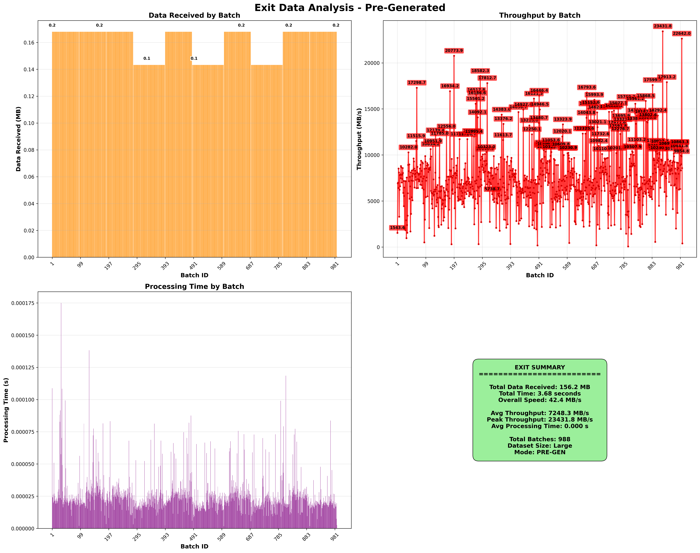     |
| **Real-Time**     | 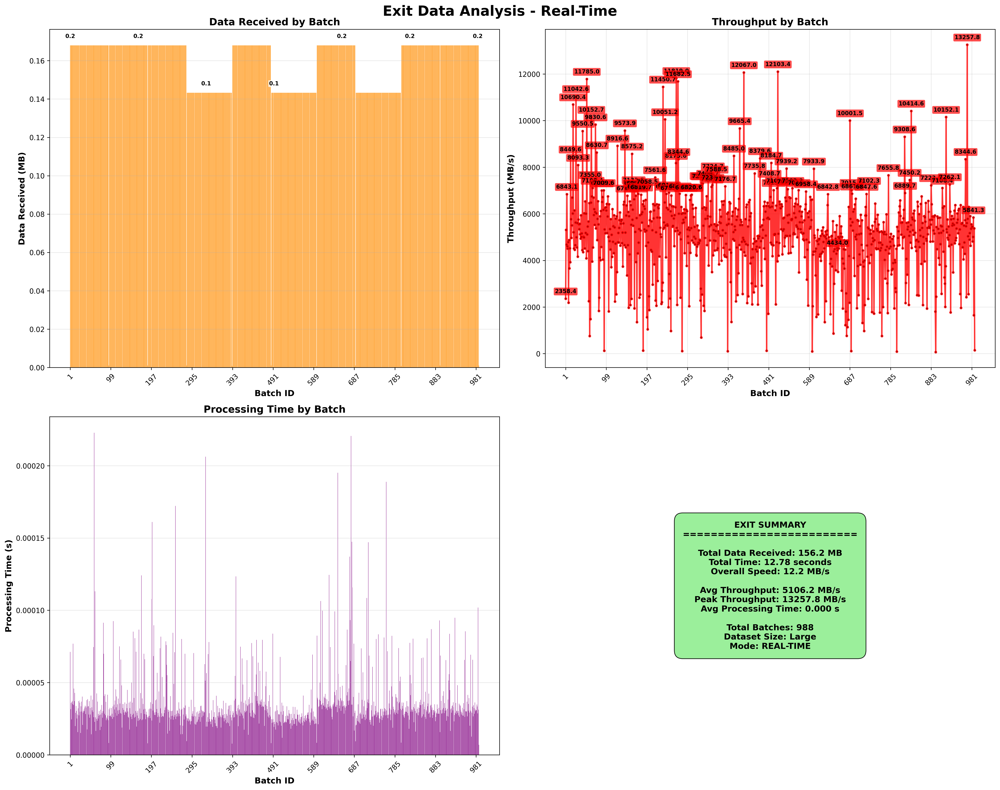 | 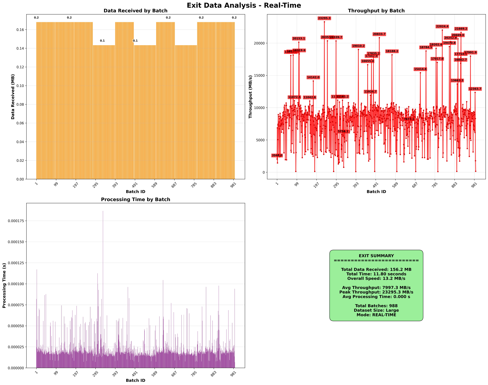 |

---
