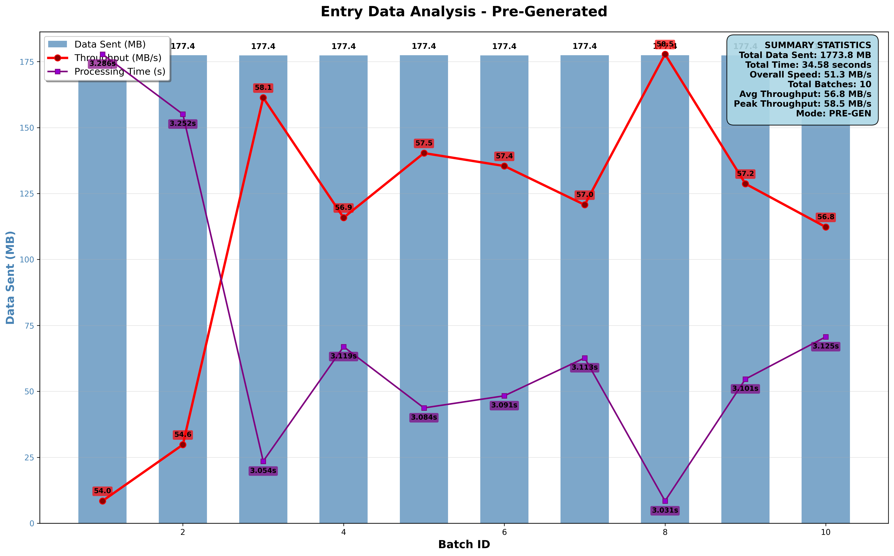
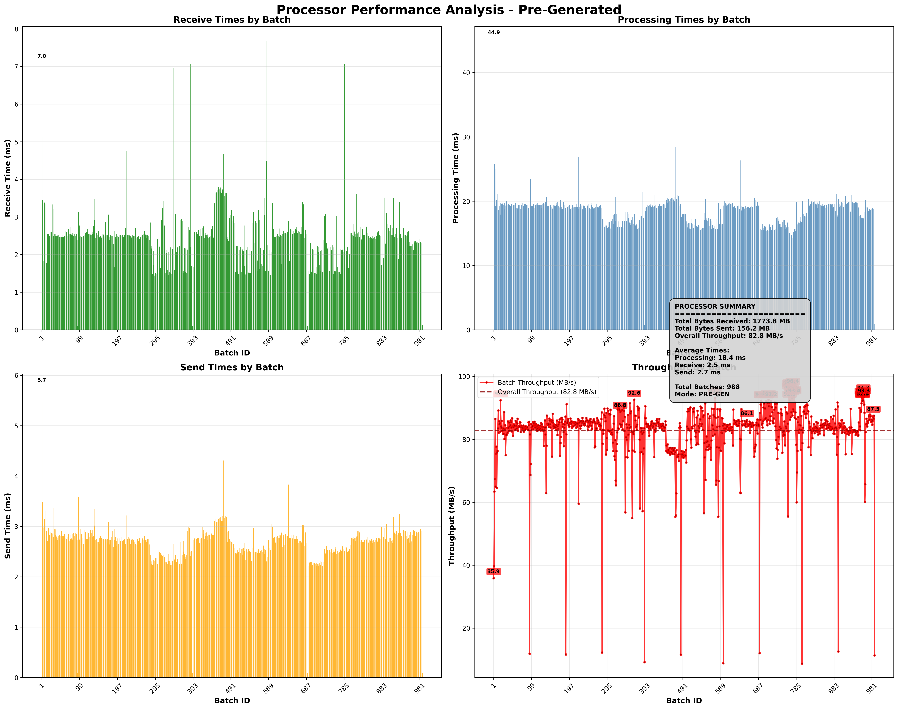
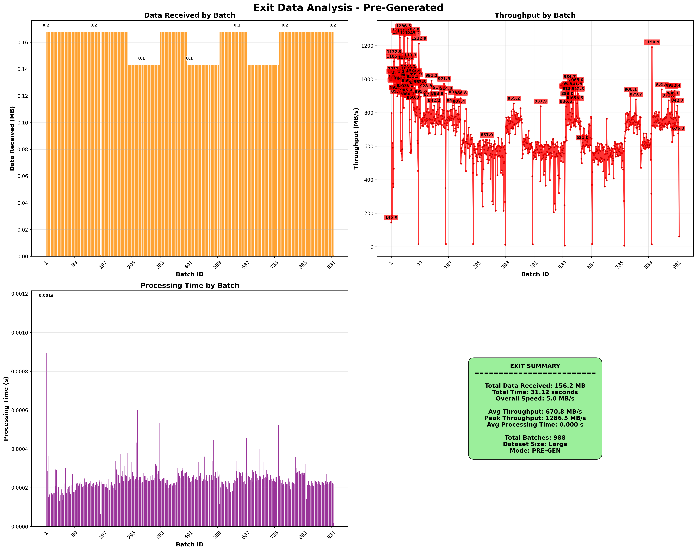
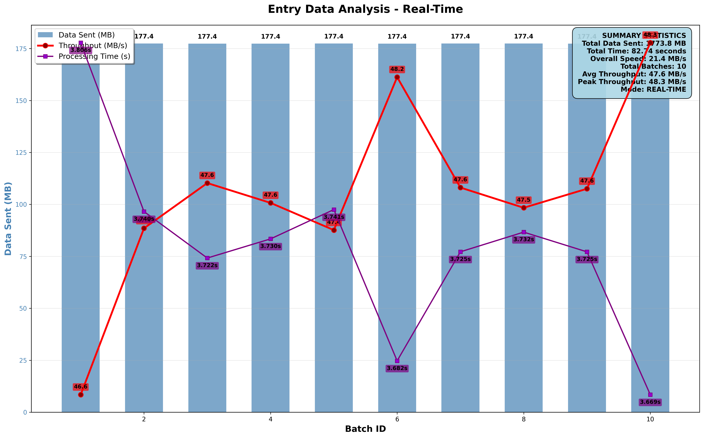
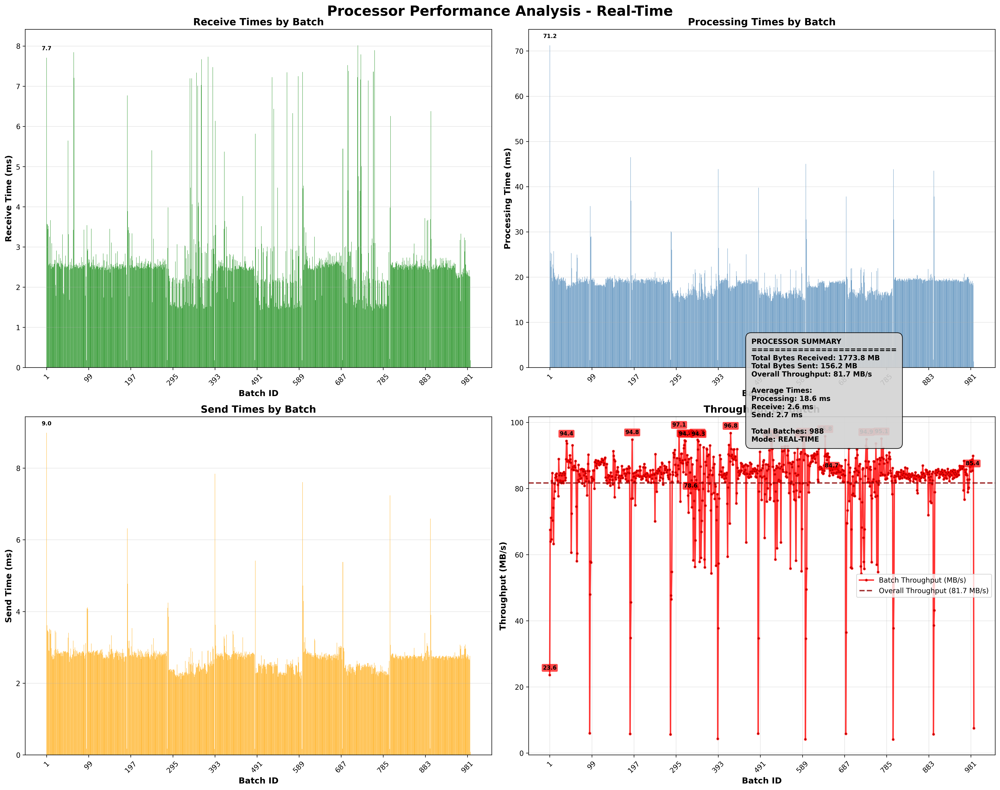
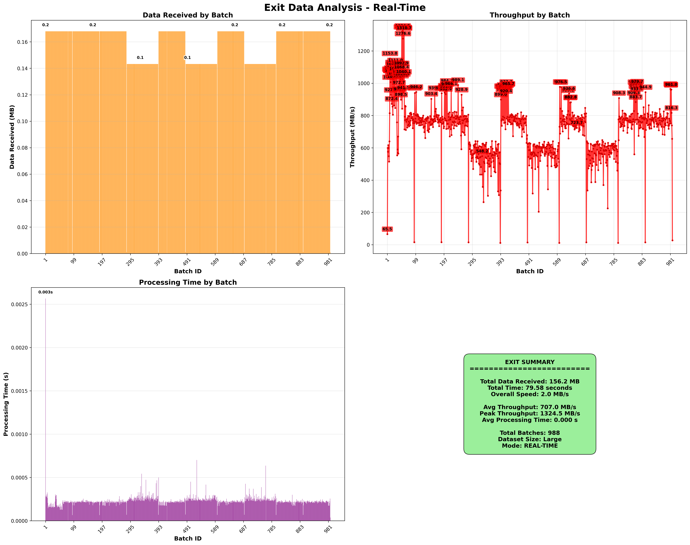

# Arrow Flight Data Pipeline with Rust

This rust project implements a distributed data streaming pipeline using Apache Arrow Flight. The system consists of three components that work together to process and transfer data in real-time.

## Architecture Overview

```
Entry Client → Processor Server → Exit Server
```

### Components

1. **Entry Client**: Generates and sends Nexmark bids data
2. **Processor Server**: Receives, processes, and forwards data
3. **Exit Server**: Final destination that receives processed data

## How It Works

### 1. Entry Client

-  Generates Nexmark auction bid data
-  Supports two modes:
   -  **Real-time**: Generates data real time during streaming
   -  **Pre-generated**: Generates all data upfront, then streams it
-  Converts data to Arrow Flight format and streams to Processor Server

### 2. Processor Server

-  Receives FlightData stream from Entry Client
-  Processes each batch (For now doing nothing)
-  Forward data to Exit Node

### 3. Exit Server

-  Receives processed data from Processor Server
-  Print statistics (Data speed) calculation

## Prerequisites

-  Rust
-  Cargo package manager

## Command Line Interface

The application uses structured command line arguments. Use `--help` to see all available options:

```bash
cargo run --help
```

## Running the System

The system requires running three separate processes in order. Open three terminal windows:

### Terminal 1: Start Exit Server

```bash
cargo run exit #default bind to localhost:8816

# custom bind address
cargo run exit --bind-address "[::1]:8817"
```

### Terminal 2: Start Processor Server

```bash
cargo run processor #default bind to [::1]:8815, default exit localhost:8816

# custom bind address
cargo run processor --bind-address "[::1]:8818" --exit-address "localhost:8817"
```

### Terminal 3: Run Entry Client

For real-time data generation:

```bash
cargo run entry real-time #connects to localhost:8815

cargo run entry --records-per-chunk 1000000 --no-records 10000000 --server-address "localhost:8815" real-time
```

For pre-generated data:

```bash
cargo run entry pre-generated

cargo run entry --records-per-chunk 1000000 --no-records 10000000 --server-address "localhost:8815" pre-generated
```

## Additional Features

### Run Nexmark Query 2

You can also run standalone Nexmark Query 2:

```bash
cargo run run-query2
```

# Performance Analysis & Results

## Overview

This project implements a distributed streaming data pipeline using Apache Arrow Flight and Nexmark benchmark data. The system measures and analyzes performance across three main components in a pipeline architecture.

```
┌─────────────┐    Flight RPC    ┌─────────────┐    Flight RPC    ┌─────────────┐
│    ENTRY    │ ──────────────► │  PROCESSOR  │ ──────────────► │    EXIT     │
│             │   ~51.3 MB/s    │             │   ~82.4 MB/s    │             │
│ Data Gen    │                 │ Transform   │                 │ Data Sink   │
│ Statistics  │                 │ Statistics  │                 │ Statistics  │
└─────────────┘                 └─────────────┘                 └─────────────┘
```

## Performance Results Analysis

### Pre-Generated Mode Performance

#### Entry Component Analysis



**📊 Key Metrics:**

-  **Overall Throughput**: 51.3 MB/s
-  **Peak Throughput**: 58.5 MB/s
-  **Processing Time Pattern**: Decreasing trend (3.252s → 3.125s)
-  **Data Consistency**: 177.4 MB per batch
-  **Total Time**: 34.58 seconds
-  **Total Batches**: 10

#### Processor Component Analysis



**📊 Key Metrics:**

-  **Overall Throughput**: 82.4 MB/s
-  **Receive Times**: 2.5ms average
-  **Processing Times**: 21.3ms average
-  **Send Times**: 2.7ms average
-  **Total Batches**: 988
-  **Total Data**: 1773.8 MB received, 156.2 MB sent

#### Exit Component Analysis



**📊 Key Metrics:**

-  **Overall Throughput**: 67.0 MB/s
-  **Peak Throughput**: 1286.5 MB/s
-  **Processing Time**: 0.0006s average
-  **Total Data**: 156.2 MB received
-  **Total Time**: 31.12 seconds
-  **Total Batches**: 988

---

### Real-Time Mode Performance

#### Entry Component Analysis



**📊 Key Metrics:**

-  **Overall Throughput**: 21.4 MB/s
-  **Peak Throughput**: 48.3 MB/s
-  **Processing Time Pattern**: Variable (3.682s → 3.696s)
-  **Total Time**: 82.74 seconds
-  **Total Data**: 1773.8 MB
-  **Total Batches**: 10

#### Processor Component Analysis



**📊 Key Metrics:**

-  **Overall Throughput**: 81.7 MB/s
-  **Receive Times**: 2.8ms average
-  **Processing Times**: 21.2ms average
-  **Send Times**: 2.7ms average
-  **Total Data**: 1773.8 MB received, 156.2 MB sent
-  **Total Batches**: 988

#### Exit Component Analysis



**📊 Key Metrics:**

-  **Overall Throughput**: 707.0 MB/s
-  **Peak Throughput**: 1374.5 MB/s
-  **Processing Time**: 0.0006s average
-  **Total Time**: 79.58 seconds
-  **Total Data**: 156.2 MB received
-  **Total Batches**: 988

---

## Performance Comparison Summary

### Throughput Analysis

| Component     | Pre-Generated | Real-Time  | Difference |
| ------------- | ------------- | ---------- | ---------- |
| **Entry**     | 51.3 MB/s     | 21.4 MB/s  | -58%       |
| **Processor** | 82.4 MB/s     | 81.7 MB/s  | -1%        |
| **Exit**      | 67.0 MB/s     | 707.0 MB/s | +955%      |

### Time Analysis

| Component     | Pre-Generated | Real-Time | Difference |
| ------------- | ------------- | --------- | ---------- |
| **Entry**     | 34.58s        | 82.74s    | +139%      |
| **Processor** | 21.12s        | Variable  | Variable   |
| **Exit**      | 31.12s        | 79.58s    | +156%      |
